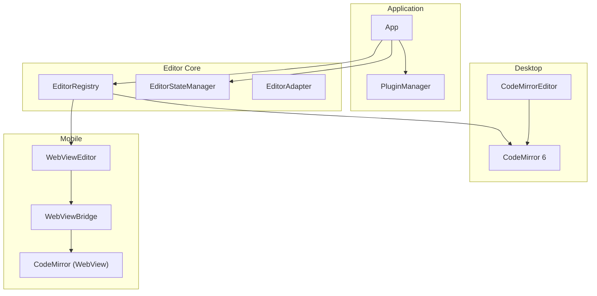
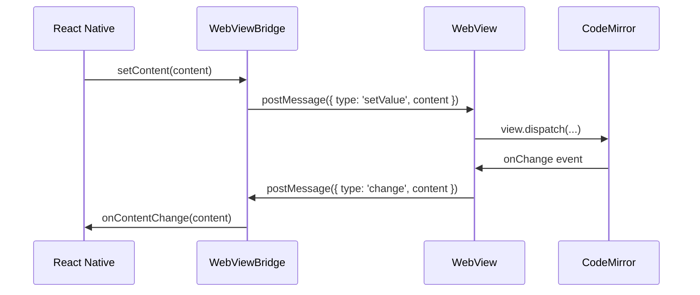

# Editor System

Inkdown uses CodeMirror 6 as its markdown editor. The editor system provides a clean abstraction layer that allows plugins to interact with the editor without knowing platform-specific details.

## Architecture Overview



## EditorRegistry

**Location**: `packages/core/src/EditorRegistry.ts`

The EditorRegistry manages CodeMirror 6 `EditorView` instances and tracks which editor is currently active.

### API

```typescript
// Register an editor instance
app.editorRegistry.register(fileId, editorView);

// Set the active editor
app.editorRegistry.setActive(fileId);

// Get the active editor view
const view = app.editorRegistry.getActive();

// Get a specific editor
const view = app.editorRegistry.get(fileId);

// Check if editor exists
if (app.editorRegistry.has(fileId)) {
  // ...
}

// Get all registered editor IDs
const ids = app.editorRegistry.getAll();

// Unregister an editor
app.editorRegistry.unregister(fileId);
```

### Usage in React Components

```typescript
import { useEffect } from 'react';
import { EditorView } from '@codemirror/view';

function MarkdownEditor({ app, fileId }) {
  const editorRef = useRef<EditorView>();
  
  useEffect(() => {
    // Create CodeMirror view
    const view = new EditorView({
      // ... configuration
    });
    
    editorRef.current = view;
    
    // Register with EditorRegistry
    app.editorRegistry.register(fileId, view);
    app.editorRegistry.setActive(fileId);
    
    return () => {
      // Cleanup
      app.editorRegistry.unregister(fileId);
      view.destroy();
    };
  }, [app, fileId]);
  
  return <div ref={containerRef} />;
}
```

## EditorStateManager

**Location**: `packages/core/src/EditorStateManager.ts`

Manages the content of open files, tracks dirty state (unsaved changes), and handles auto-saving.

### Features

- **Content Management**: Stores editor content separately from file system
- **Dirty Tracking**: Knows which files have unsaved changes
- **Auto-save**: Automatically saves dirty files at intervals
- **Debounced Saves**: Prevents excessive writes during typing

### API

```typescript
// Get content for a file
const content = app.editorStateManager.getContent(filePath);

// Set content (marks as dirty)
app.editorStateManager.setContent(filePath, newContent);

// Check if file has unsaved changes
const isDirty = app.editorStateManager.isDirty(filePath);

// Save a specific file
await app.editorStateManager.saveFile(filePath);

// Save all dirty files
await app.editorStateManager.saveAllDirty();

// Clear content (when file is closed)
app.editorStateManager.clearContent(filePath);
```

## EditorAdapter

**Location**: `packages/core/src/editor/EditorAdapter.ts`

Provides a plugin-friendly API for interacting with CodeMirror. This adapter wraps the CodeMirror `EditorView` to provide a stable API that plugins can depend on.

### API

```typescript
// Get the adapter for the active editor
const editor = app.workspace.activeEditor;

if (editor) {
  // Get/set content
  const content = editor.getValue();
  editor.setValue('New content');
  
  // Get/set selection
  const { from, to } = editor.getSelection();
  editor.setSelection(10, 20);
  
  // Replace selection
  editor.replaceSelection('replacement text');
  
  // Get line information
  const lineNumber = editor.getCursor().line;
  const lineContent = editor.getLine(lineNumber);
  const lineCount = editor.lineCount();
  
  // Replace range
  editor.replaceRange('new text', { line: 0, ch: 0 }, { line: 0, ch: 5 });
  
  // Focus the editor
  editor.focus();
}
```

### Position Interface

```typescript
interface EditorPosition {
  line: number;  // 0-indexed line number
  ch: number;    // Character position in line
}
```

## Plugin Integration

### Registering Editor Extensions

Plugins can register CodeMirror extensions that are applied to all editor instances:

```typescript
import { Plugin } from '@inkdown/core';
import { ViewPlugin, Decoration, DecorationSet } from '@codemirror/view';

class MyPlugin extends Plugin {
  async onload() {
    // Register a CodeMirror extension
    this.registerEditorExtension(
      ViewPlugin.fromClass(class {
        decorations: DecorationSet;
        
        constructor(view) {
          this.decorations = this.buildDecorations(view);
        }
        
        update(update) {
          if (update.docChanged || update.viewportChanged) {
            this.decorations = this.buildDecorations(update.view);
          }
        }
        
        buildDecorations(view) {
          // Build decorations...
          return Decoration.none;
        }
      }, {
        decorations: v => v.decorations
      })
    );
  }
}
```

### Accessing the Editor

Plugins can access the active editor through the Workspace:

```typescript
class MyPlugin extends Plugin {
  async onload() {
    this.addCommand({
      id: 'insert-text',
      name: 'Insert Text',
      callback: () => {
        const editor = this.app.workspace.activeEditor;
        if (editor) {
          editor.replaceSelection('Inserted text');
        }
      }
    });
  }
}
```

## CodeMirror 6 Extensions

Inkdown includes several built-in CodeMirror extensions:

### Core Extensions

- **Markdown Language Support**: Syntax highlighting for markdown
- **Line Numbers**: Optional line numbers in the gutter
- **Line Wrapping**: Soft wrap long lines
- **Auto-close Brackets**: Automatically close `()`, `[]`, `{}`
- **Vim Mode**: Optional Vim keybindings
- **Bracket Matching**: Highlight matching brackets
- **Search**: Find and replace functionality
- **History**: Undo/redo support

### Editor Configuration

Editor behavior is configured through the `editor` config:

```json
{
  "autoPairBrackets": true,
  "tabIndentation": true,
  "convertPastedHtmlToMarkdown": true,
  "vimMode": false,
  "lineNumbers": true,
  "lineWrapping": true
}
```

## Platform Implementations

### Desktop (Tauri)

On desktop, CodeMirror 6 runs directly in the React app:

```typescript
import { EditorView, basicSetup } from '@codemirror/basic-setup';
import { markdown } from '@codemirror/lang-markdown';

const view = new EditorView({
  doc: initialContent,
  extensions: [
    basicSetup,
    markdown(),
    // Plugin extensions
    ...app.pluginManager.getAllEditorExtensions()
  ],
  parent: containerElement
});
```

### Mobile (React Native)

On mobile, CodeMirror runs inside a WebView with a JavaScript bridge for communication:



## Editor Events

The App handles editor events and routes them to appropriate systems:

```typescript
// In App.ts
handleEditorUpdate(update: ViewUpdate): void {
  if (!update.docChanged && !update.selectionSet) return;
  
  const view = update.view;
  const cursor = view.state.selection.main.head;
  const line = view.state.doc.lineAt(cursor);
  
  const editorPosition = {
    line: line.number - 1, // 0-indexed
    ch: cursor - line.from,
  };
  
  // Notify EditorSuggest instances
  for (const suggest of this.editorSuggests) {
    suggest.onCursorChange(editorPosition, view, null);
  }
}

handleKeyDown(evt: KeyboardEvent): boolean {
  // Check if any suggest is open and wants to handle the key
  for (const suggest of this.editorSuggests) {
    if (suggest.isOpen && suggest.handleKeyDown(evt)) {
      return true;
    }
  }
  return false;
}
```

## Editor Suggest

**Location**: `packages/core/src/components/EditorSuggest.ts`

Editor suggests provide autocomplete functionality (like `[[` for links):

```typescript
import { EditorSuggest } from '@inkdown/core';

class LinkSuggest extends EditorSuggest<TFile> {
  getSuggestions(context: EditorSuggestContext): TFile[] {
    const query = context.query;
    return this.app.workspace.getMarkdownFiles()
      .filter(file => file.basename.includes(query));
  }
  
  renderSuggestion(file: TFile, el: HTMLElement): void {
    el.textContent = file.basename;
  }
  
  selectSuggestion(file: TFile): void {
    // Insert the link
    this.context.editor.replaceRange(
      `[[${file.path}]]`,
      this.context.start,
      this.context.end
    );
  }
}

// Register in plugin
this.registerEditorSuggest(new LinkSuggest(this.app));
```

## Related Documentation

- [Architecture Overview](/architecture/overview) - High-level architecture
- [App and Managers](/architecture/app-managers) - Manager APIs
- [Plugin Development](/plugins/introduction) - Creating plugins with editor extensions
- [CodeMirror 6 Documentation](https://codemirror.net/docs/) - Official CodeMirror docs