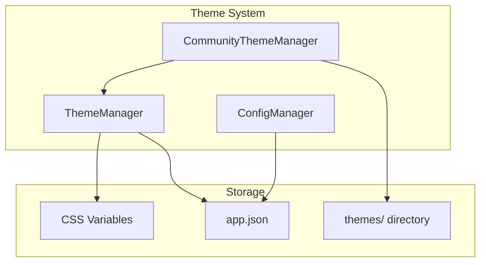
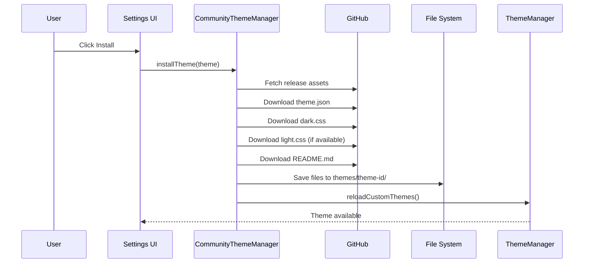

# Theme System

Inkdown features a comprehensive theme system that supports both built-in and community themes with hot-swapping and CSS variable-based customization.

## Architecture

The theme system consists of three main components:

1. **ThemeManager** - Manages theme loading, switching, and color scheme
2. **CommunityThemeManager** - Handles community theme discovery and installation
3. **ConfigManager** - Persists theme preferences



## ThemeManager

**Location**: `packages/core/src/ThemeManager.ts`

Manages theme loading, switching, and CSS injection.

### Initialization

```typescript
async init(): Promise<void> {
    // 1. Register built-in themes
    this.registerBuiltInThemes();
    
    // 2. Load custom themes from disk
    await this.loadCustomThemes();
    
    // 3. Load saved preference from config
    const config = await this.app.configManager.loadConfig('app');
    this.colorScheme = config?.colorScheme || 'dark';
    this.currentTheme = config?.theme || 'default-dark';
    
    // 4. Apply the theme
    await this.emitThemeChange();
}
```

### Theme Application

**Built-in Themes** use CSS classes already in the bundle:

```typescript
// Simply swap the class on documentElement
document.documentElement.className = 'theme-dark';
```

**Custom Themes** inject CSS dynamically:

```typescript
private async applyCustomTheme(themeId: string): Promise<void> {
  // Remove existing custom theme
  const existing = document.getElementById('inkdown-custom-theme');
  if (existing) existing.remove();
  
  // Load CSS from themes directory
  const cssContent = await native.fs.readThemeCss(
    themeId, 
    `${this.colorScheme}.css`
  );
  
  // Inject new theme CSS
  const styleElement = document.createElement('style');
  styleElement.id = 'inkdown-custom-theme';
  styleElement.textContent = cssContent;
  document.head.appendChild(styleElement);
}
```

### API

```typescript
// Set theme
await app.themeManager.setTheme('gruvbox-dark');

// Set color scheme (dark/light)
await app.themeManager.setColorScheme('dark');

// Get current theme
const themeId = app.themeManager.getCurrentTheme();
const scheme = app.themeManager.getColorScheme();

// Get all available themes
const themes = app.themeManager.getThemes();
// Returns: ThemeConfig[]

// Check if theme exists
if (app.themeManager.hasTheme('gruvbox-dark')) {
  // Theme is available
}

// Get theme as parsed object (for React Native)
const themeObj = await app.themeManager.getCurrentThemeObject();

// Reload custom themes (after install/uninstall)
await app.themeManager.reloadCustomThemes();

// Listen to theme changes
app.themeManager.on('theme-changed', (event: ThemeChangeEvent) => {
  console.log('Theme changed to:', event.themeId);
  console.log('Color scheme:', event.colorScheme);
  console.log('Parsed theme:', event.theme);
  console.log('CSS content:', event.cssContent); // For custom themes
});
```

### ThemeConfig Interface

```typescript
interface ThemeConfig {
  id: string;           // Theme directory name
  name: string;         // Display name
  author?: string;
  version?: string;
  description?: string;
  homepage?: string;
  modes: ColorScheme[]; // ['dark'] | ['light'] | ['dark', 'light']
  builtIn?: boolean;    // true for default themes
}

type ColorScheme = 'dark' | 'light';
```

## CommunityThemeManager

**Location**: `packages/core/src/CommunityThemeManager.ts`

Handles community themes from GitHub releases.

### Features

| Feature | Description |
|---------|-------------|
| Theme Discovery | Fetches listings from community registry |
| GitHub Integration | Downloads themes from GitHub releases |
| Caching | 1-hour in-memory cache for listings |
| Version Tracking | Detects available updates |
| Installation | Downloads and saves theme files locally |

### Theme Installation Flow



### API

```typescript
// Initialize (scans installed themes)
await app.communityThemeManager.init();

// Get theme listings
const listings = await app.communityThemeManager.getThemeListings();
const listings = await app.communityThemeManager.getThemeListings(true); // force refresh

// Get full theme details from GitHub release
const theme = await app.communityThemeManager.getThemeDetails(listing);

// Check installation status
const isInstalled = app.communityThemeManager.isThemeInstalled('owner/repo');
const version = app.communityThemeManager.getInstalledVersion('owner/repo');
const hasUpdate = app.communityThemeManager.hasUpdate(theme);

// Install/uninstall
await app.communityThemeManager.installTheme(theme);
await app.communityThemeManager.uninstallTheme('owner/repo');

// Get installed themes
const installed = app.communityThemeManager.getInstalledThemes();

// Utility methods
const screenshotUrl = app.communityThemeManager.getScreenshotUrl(listing);
const repoUrl = app.communityThemeManager.getRepoUrl('owner/repo');

// Clear cache
app.communityThemeManager.clearCache();
```

### Types

```typescript
interface CommunityThemeListing {
  id: string;           // Unique identifier
  name: string;         // Display name
  author: string;       // Author name
  repo: string;         // GitHub repo ("owner/repo")
  branch?: string;      // Branch name (default: "main")
  screenshot: string;   // Screenshot path in repo
  modes: ColorScheme[];
}

interface CommunityTheme {
  listing: CommunityThemeListing;
  manifest: CommunityThemeManifest;
  readme: string;
  screenshotUrl: string;
  releaseTag: string;
  releaseAssets: any[];
  installed: boolean;
  installedVersion?: string;
}

interface InstalledCommunityTheme {
  id: string;
  name: string;
  author: string;
  version: string;
  installedAt: number;
  modes: ColorScheme[];
}
```

## Theme File Structure

Custom themes are stored in the app's config directory:

```
~/Library/Application Support/com.furqas.inkdown/themes/
└── theme-name/
    ├── theme.json       # Theme metadata (required)
    ├── dark.css         # Dark mode styles (required if modes includes 'dark')
    ├── light.css        # Light mode styles (optional)
    └── README.md        # Theme documentation (optional)
```

### theme.json

```json
{
  "name": "Gruvbox Dark",
  "author": "Author Name",
  "version": "1.0.0",
  "description": "A retro groove color scheme",
  "homepage": "https://github.com/author/theme-repo",
  "modes": ["dark", "light"]
}
```

### CSS Files

Theme CSS must use the appropriate class selector and define CSS variables:

```css
/* dark.css */
.theme-dark {
    /* Background Colors */
    --bg-primary: #1d2021;
    --bg-secondary: #282828;
    --bg-sidebar: #1f2335;
    --bg-tertiary: #32302f;

    /* Text Colors */
    --text-primary: #ebdbb2;
    --text-secondary: #d5c4a1;
    --text-muted: #928374;

    /* Accent Colors */
    --color-primary: #fe8019;
    --color-primary-hover: #fabd2f;
    --color-success: #b8bb26;
    --color-warning: #fabd2f;
    --color-danger: #fb4934;
    
    /* Border Colors */
    --border-primary: #3c3836;
    --border-secondary: #504945;
    
    /* Editor Colors */
    --editor-bg: #1d2021;
    --editor-cursor: #fe8019;
    --editor-selection: rgba(254, 128, 25, 0.2);
}
```

## CSS Variables Reference

### Background Colors

```css
--bg-primary        /* Main background */
--bg-secondary      /* Secondary elements */
--bg-tertiary       /* Tertiary elements */
--bg-sidebar        /* Sidebar background */
--bg-hover          /* Hover state */
--bg-active         /* Active state */
```

### Text Colors

```css
--text-primary      /* Primary text */
--text-secondary    /* Secondary text */
--text-muted        /* Muted/hint text */
--text-link         /* Link color */
```

### Accent Colors

```css
--color-primary     /* Primary accent */
--color-success     /* Success state */
--color-warning     /* Warning state */
--color-danger      /* Error/danger state */
--color-info        /* Info state */
```

### Border Colors

```css
--border-primary    /* Primary borders */
--border-secondary  /* Secondary borders */
--border-focus      /* Focus state */
```

### Editor Colors

```css
--editor-bg         /* Editor background */
--editor-cursor     /* Cursor color */
--editor-selection  /* Selection highlight */
--editor-line-highlight  /* Current line */
```

## Creating Custom Themes

See the [Creating Themes](/themes/quickstart) guide for step-by-step instructions.

## Built-in Themes

Inkdown ships with two built-in themes:

### default-dark

- Modern dark theme with good contrast
- Blue accents
- Optimized for extended use

### default-light

- Clean light theme
- Blue accents
- Easy on the eyes in bright environments

## Theme Switching Behavior

When switching color schemes:

1. **Theme supports both modes**: Switches to the requested mode
2. **Theme only supports one mode**: Switches to default theme for that mode

Example:

```typescript
// Using a dark-only theme
await app.themeManager.setTheme('gruvbox-dark');

// Try to switch to light mode
await app.themeManager.setColorScheme('light');
// Result: Switches to 'default-light' because gruvbox-dark doesn't support light mode
```

## Related Documentation

- [Creating Themes](/themes/quickstart) - Step-by-step theme creation
- [Config System](/architecture/config-system) - Configuration persistence
- [App and Managers](/architecture/app-managers) - Manager APIs