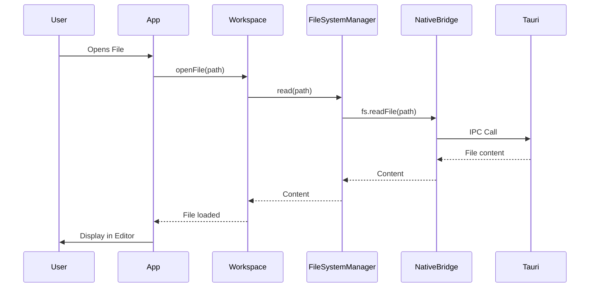

Inkdown is a modern, cross-platform markdown note-taking application built with **Tauri v2**, **React 19**, and **TypeScript**. It follows a modular monorepo architecture with a platform-agnostic core and platform-specific adapters, enabling true cross-platform compatibility across Desktop, Web, and potentially Mobile platforms.

## Monorepo Structure

Inkdown is organized as a **Bun monorepo** with clear separation between application layers, core business logic, and platform-specific implementations.

<CodeGroup>
```bash Workspace Structure
inkdown/
├── apps/                    # Platform-specific applications
│   ├── desktop/            # Tauri desktop app
│   └── mobile/             # React Native mobile app (future)
├── packages/               # Core packages
│   ├── core/              # Platform-agnostic business logic
│   ├── ui/                # Shared React components
│   ├── plugins/           # Built-in plugins
│   ├── plugin-api/        # Public plugin API
│   ├── editor-webview/    # CodeMirror editor adapter
│   ├── native-tauri/      # Tauri platform adapter
│   ├── native-expo/       # Expo/React Native adapter
│   ├── storage-tauri/     # Tauri storage implementation
│   └── storage-mobile/    # Mobile storage implementation
```
</CodeGroup>

## Architecture Layers

The architecture consists of three primary layers:

### 1. Application Layer

Platform-specific entry points that bootstrap the application:

- **Desktop App** (`apps/desktop`): Built with Tauri + React
- **Mobile App** (`apps/mobile`): React Native with Expo (in development)
- **Web App** (future): Browser-based version

### 2. Core Layer

Platform-agnostic packages that contain business logic:

<CardGroup cols={2}>
  <Card title="@inkdown/core" icon="cube">
    Central business logic, managers, and Plugin API. The foundation of Inkdown.
  </Card>
  <Card title="@inkdown/ui" icon="palette">
    Shared React component library for design consistency across platforms.
  </Card>
  <Card title="@inkdown/plugins" icon="puzzle-piece">
    Built-in plugins providing core functionality like live preview and word count.
  </Card>
  <Card title="@inkdown/plugin-api" icon="code">
    Public API for community plugin developers.
  </Card>
</CardGroup>

### 3. Platform Adapter Layer

Platform-specific implementations that bridge core functionality to native capabilities:

<AccordionGroup>
  <Accordion title="Editor Adapters">
    - **@inkdown/editor-webview**: CodeMirror 6 implementation (Desktop, Web)
    - Future: React Native editor adapters
  </Accordion>
  
  <Accordion title="Native Adapters">
    - **@inkdown/native-tauri**: File system, dialogs, clipboard via Tauri IPC
    - **@inkdown/native-expo**: React Native native modules
    - Future: Web browser APIs adapter
  </Accordion>
  
  <Accordion title="Storage Adapters">
    - **@inkdown/storage-tauri**: File system-based storage for desktop
    - **@inkdown/storage-mobile**: AsyncStorage for mobile
  </Accordion>
</AccordionGroup>

## Core System (`@inkdown/core`)

The Core package is the foundation of Inkdown, exposing the main `App` class and various specialized managers.

### The App Class

```typescript App.ts
import { App } from '@inkdown/core';

// Create app instance with built-in plugins
const app = new App(builtInPlugins);

// Initialize all managers
await app.init();

// Access managers
const files = await app.workspace.getMarkdownFiles();
const activeEditor = app.editorRegistry.getActive();
```

### Key Managers

The `App` class coordinates multiple specialized managers:

<ResponseField name="workspace" type="Workspace">
  Manages file operations (CRUD) and file events. Acts as the central file management system.
</ResponseField>

<ResponseField name="workspaceUI" type="WorkspaceUI">
  Manages UI state including tabs, views, and active file display.
</ResponseField>

<ResponseField name="pluginManager" type="PluginManager">
  Handles built-in plugin loading, enabling, and disabling.
</ResponseField>

<ResponseField name="communityPluginManager" type="CommunityPluginManager">
  Manages community plugin discovery, installation, and updates from GitHub.
</ResponseField>

<ResponseField name="configManager" type="ConfigManager">
  Persistent configuration storage (JSON files in app config directory).
</ResponseField>

<ResponseField name="themeManager" type="ThemeManager">
  Theme loading, switching, and CSS injection for built-in themes.
</ResponseField>

<ResponseField name="tabManager" type="TabManager">
  Handles tab management, restoration, and persistence.
</ResponseField>

<ResponseField name="commandManager" type="CommandManager">
  Central registry for all commands (plugin and built-in).
</ResponseField>

<ResponseField name="editorRegistry" type="EditorRegistry">
  Manages CodeMirror editor instances and provides access to active editor.
</ResponseField>

<ResponseField name="editorStateManager" type="EditorStateManager">
  Manages content of open files, dirty states, and auto-saving.
</ResponseField>

<ResponseField name="metadataCache" type="MetadataCache">
  Caches file metadata and frontmatter for quick access.
</ResponseField>

<ResponseField name="bookmarkManager" type="BookmarkManager">
  Manages bookmarked files and bookmark groups.
</ResponseField>

<ResponseField name="fontManager" type="FontManager">
  System font discovery and management.
</ResponseField>

<ResponseField name="syncManager" type="SyncManager">
  Handles workspace synchronization.
</ResponseField>

## Initialization Flow

The application follows a specific initialization sequence to ensure all dependencies are loaded in the correct order:

```typescript App.ts (simplified)
async init(): Promise<void> {
    // 1. Initialize config manager (needed by other managers)
    await this.configManager.init();
    
    // 2. Load system fonts
    await this.fontManager.loadSystemFonts();
    
    // 3. Load and apply theme
    await this.loadTheme();
    
    // 4. Initialize community theme manager
    await this.communityThemeManager.init();
    
    // 5. Initialize sync manager
    await this.syncManager.init();
    
    // 6. Initialize bookmark manager
    await this.bookmarkManager.init();
    
    // 7. Initialize community plugin manager
    await this.communityPluginManager.init();
    await this.communityPluginManager.loadAllInstalledPlugins();
    
    // 8. Load all plugins (built-in + community)
    await this.loadPlugins();
    
    // 9. Initialize tab manager and restore tabs
    await this.tabManager.init();
}
```

<Note>
The initialization order is critical. For example, `configManager` must be initialized before other managers that depend on configuration, and plugins must be loaded before tabs are restored.
</Note>

## Technology Stack

<CardGroup cols={2}>
  <Card title="Desktop Framework" icon="window">
    **Tauri v2** - Rust backend with web frontend
  </Card>
  <Card title="Frontend" icon="react">
    **React 19** + TypeScript
  </Card>
  <Card title="Editor" icon="code">
    **CodeMirror 6** - Extensible code editor
  </Card>
  <Card title="Styling" icon="paintbrush">
    **CSS Variables** - No Tailwind, theme-first approach
  </Card>
  <Card title="Package Manager" icon="box">
    **Bun** - Fast JavaScript runtime and package manager
  </Card>
  <Card title="Build Tool" icon="gear">
    **Vite** - Next-generation frontend tooling
  </Card>
  <Card title="Linting" icon="shield-check">
    **Biome** - Fast formatter and linter
  </Card>
  <Card title="Mobile" icon="mobile">
    **React Native + Expo** - Cross-platform mobile
  </Card>
</CardGroup>

## Data Flow

Here's how a typical file operation flows through the architecture:



<Info>
The **NativeBridge** pattern allows the same core code to work across different platforms by swapping out the native implementation at runtime.
</Info>

## Benefits of This Architecture

<CardGroup cols={2}>
  <Card title="Platform Agnostic" icon="globe">
    Write business logic once, run on Desktop, Web, and Mobile
  </Card>
  <Card title="Type Safe" icon="shield">
    Full TypeScript coverage ensures compile-time checking
  </Card>
  <Card title="Testable" icon="flask">
    Easy to mock platform implementations for unit testing
  </Card>
  <Card title="Extensible" icon="plug">
    Plugin system allows community extensions
  </Card>
  <Card title="Maintainable" icon="wrench">
    Clear separation of concerns and single responsibility
  </Card>
  <Card title="Performance" icon="bolt">
    No runtime overhead - abstractions are compile-time only
  </Card>
</CardGroup>

## Related Documentation

<CardGroup cols={2}>
  <Card title="Plugin System" icon="puzzle-piece" href="/concepts/plugin-system">
    Learn about Inkdown's plugin architecture and API
  </Card>
  <Card title="Workspace" icon="folder" href="/concepts/workspace">
    Understand workspace management and file operations
  </Card>
  <Card title="Cross-Platform" icon="layer-group" href="/concepts/cross-platform">
    Deep dive into the bridge pattern and platform adapters
  </Card>
  <Card title="Build a Plugin" icon="code" href="/plugins/introduction">
    Start building your first Inkdown plugin
  </Card>
</CardGroup>