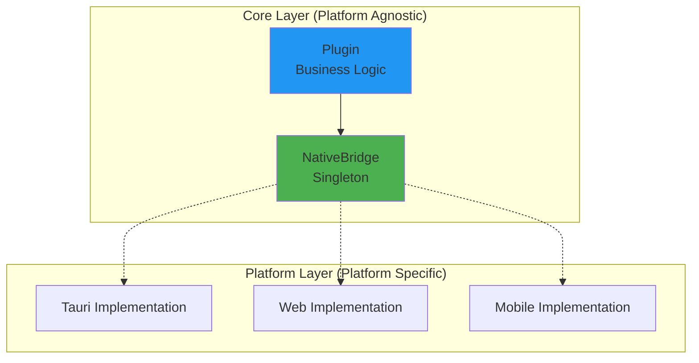

Inkdown is architected from the ground up to be truly cross-platform, capable of running on Desktop (via Tauri), Web browsers, and React Native mobile applications with a single shared codebase for business logic and plugins.

## Core Principles

The cross-platform architecture is built on three fundamental principles:

<CardGroup cols={3}>
  <Card title="Platform-Agnostic Core" icon="cube">
    All business logic and plugin APIs are implemented without platform-specific dependencies
  </Card>
  <Card title="Bridge Pattern" icon="bridge">
    Platform-specific functionality is accessed through abstract interfaces
  </Card>
  <Card title="Dependency Injection" icon="plug">
    Platform implementations are registered at runtime
  </Card>
</CardGroup>

## The Bridge Pattern

Inkdown uses the **Bridge Pattern** to decouple platform-agnostic core logic from platform-specific implementations. This allows the same code to run on different platforms by swapping out the implementation at runtime.

### How Bridges Work



The bridge acts as a singleton that holds a reference to the platform-specific implementation. Core code calls methods on the bridge, which delegates to the registered implementation.

## Native Bridge

The `NativeBridge` provides access to platform-specific native capabilities:

### Bridge Architecture

```typescript NativeBridge.ts
import { native } from '@inkdown/core';

// Platform implementations register themselves at startup
native.registerModule('fs', new TauriFileSystem());
native.registerModule('dialog', new TauriDialog());
native.registerModule('clipboard', new TauriClipboard());

// Core code uses the bridge without knowing the platform
const content = await native.fs.readFile('/path/to/file.md');
```

### Available Modules

<AccordionGroup>
  <Accordion title="File System (fs)" icon="folder">
    Platform-agnostic file system operations:
    
    ```typescript
    // Read file
    const content = await native.fs.readFile(path);
    
    // Write file
    await native.fs.writeFile(path, content);
    
    // List directory
    const entries = await native.fs.listDirectory(path);
    
    // Watch directory
    const unwatch = await native.fs.watchDirectory(path, (events) => {
        console.log('File system events:', events);
    });
    ```
    
    **Desktop (Tauri)**: Direct OS file system access
    **Web**: IndexedDB virtual file system
    **Mobile**: React Native File System API
  </Accordion>
  
  <Accordion title="Dialog (dialog)" icon="message-square">
    Native dialog prompts:
    
    ```typescript
    // Save dialog
    const result = await native.dialog?.showSaveDialog({
        defaultPath: 'export.md',
        filters: [{ name: 'Markdown', extensions: ['md'] }]
    });
    
    // Open dialog
    const files = await native.dialog?.showOpenDialog({
        multiple: true,
        filters: [{ name: 'Markdown', extensions: ['md'] }]
    });
    ```
    
    **Desktop (Tauri)**: Native OS dialogs
    **Web**: Browser file picker API
    **Mobile**: React Native document picker
  </Accordion>
  
  <Accordion title="Clipboard (clipboard)" icon="clipboard">
    System clipboard access:
    
    ```typescript
    // Write to clipboard
    await native.clipboard?.writeText('Hello, World!');
    
    // Read from clipboard
    const text = await native.clipboard?.readText();
    ```
    
    **Desktop (Tauri)**: System clipboard
    **Web**: Clipboard API
    **Mobile**: React Native Clipboard
  </Accordion>
  
  <Accordion title="Platform (platform)" icon="info">
    Platform information and capabilities:
    
    ```typescript
    // Get platform info
    const info = native.platform.info;
    console.log(info.type);      // 'desktop' | 'web' | 'mobile'
    console.log(info.os);        // 'windows' | 'macos' | 'linux' | 'ios' | 'android'
    console.log(info.version);   // OS version
    
    // Window controls (desktop only)
    await native.platform.window?.minimize();
    await native.platform.window?.maximize();
    await native.platform.window?.close();
    ```
  </Accordion>
  
  <Accordion title="Export (export)" icon="download">
    File export capabilities:
    
    ```typescript
    // Export to PDF
    await native.export.toPDF(content, options);
    
    // Export to HTML
    await native.export.toHTML(content, options);
    ```
  </Accordion>
  
  <Accordion title="Config (config)" icon="settings">
    Configuration storage:
    
    ```typescript
    // Load config
    const config = await native.config.load('app');
    
    // Save config
    await native.config.save('app', config);
    ```
    
    **Desktop (Tauri)**: JSON files in config directory
    **Web**: LocalStorage
    **Mobile**: AsyncStorage
  </Accordion>
  
  <Accordion title="Font (font)" icon="type">
    System font access:
    
    ```typescript
    // List system fonts
    const fonts = await native.font?.listSystemFonts();
    ```
    
    **Desktop (Tauri)**: Native font enumeration
    **Web**: CSS font API
    **Mobile**: Limited/fallback fonts
  </Accordion>
</AccordionGroup>

### Feature Detection

Not all platforms support all features. Use feature detection:

```typescript
// Check if a module is available
if (native.supportsModule('dialog')) {
    await native.dialog?.showSaveDialog(options);
} else {
    // Fallback behavior
    showCustomDialog(options);
}

// Check if a platform feature is supported
if (native.supports('nativeDialog')) {
    // Use native dialog
} else if (native.supports('fileSystemAccess')) {
    // Use browser file system API
} else {
    // Use fallback
}
```

<Tip>
Always check for optional modules and features before using them to ensure graceful degradation across platforms.
</Tip>

## Storage Bridge

The `StorageBridge` provides platform-agnostic storage for caching and persistence:

```typescript StorageBridge.ts
import { StorageBridge } from '@inkdown/core';

const storage = StorageBridge.getInstance();

// Key-Value storage
await storage.kv.set('key', 'value');
const value = await storage.kv.get('key');
await storage.kv.delete('key');

// Document storage (for complex objects)
await storage.doc.create('tabs', { id: '1', filePath: 'note.md' });
const tab = await storage.doc.read('tabs', '1');
await storage.doc.update('tabs', '1', { filePath: 'updated.md' });
await storage.doc.delete('tabs', '1');
```

### Storage Implementations

<CodeGroup>
```typescript Desktop (Tauri)
import { IndexedDBStorage } from '@inkdown/storage-tauri';

// Uses IndexedDB for structured storage
StorageBridge.getInstance().registerStorageProviders(
    new IndexedDBKVStorage(),
    new IndexedDBDocumentStorage()
);
```

```typescript Web
import { IndexedDBStorage } from '@inkdown/storage-web';

// Uses IndexedDB (same as Tauri)
StorageBridge.getInstance().registerStorageProviders(
    new IndexedDBKVStorage(),
    new IndexedDBDocumentStorage()
);
```

```typescript Mobile
import { AsyncStorage } from '@inkdown/storage-mobile';

// Uses React Native AsyncStorage
StorageBridge.getInstance().registerStorageProviders(
    new AsyncKVStorage(),
    new AsyncDocumentStorage()
);
```
</CodeGroup>

## UI Bridge

The `UIBridge` abstracts UI rendering for cross-platform compatibility:

```typescript
import { UIBridge } from '@inkdown/core';

// Show modal (works on Desktop, Web, Mobile)
UIBridge.showModal({
    title: 'Settings',
    component: SettingsModal,
    props: { settings }
});

// Show notice
UIBridge.showNotice('File saved!', 3000);

// Create setting UI
const setting = UIBridge.createSetting()
    .setName('Enable feature')
    .setDesc('Toggle this feature')
    .addToggle(toggle => {
        toggle.setValue(enabled);
        toggle.onChange(value => { /* ... */ });
    });
```

<Warning>
Plugins should use `UIBridge` or high-level abstractions (`Modal`, `Setting`, `Notice`) instead of direct DOM manipulation to ensure mobile compatibility.
</Warning>

## Platform Initialization

Each platform registers its implementations at startup:

<CodeGroup>
```typescript Desktop (Tauri)
import { App } from '@inkdown/core';
import { native } from '@inkdown/core';
import { StorageBridge } from '@inkdown/core';
import {
    TauriFileSystem,
    TauriDialog,
    TauriClipboard,
    TauriPlatform,
    TauriConfig,
    TauriExport
} from '@inkdown/native-tauri';
import {
    IndexedDBKVStorage,
    IndexedDBDocumentStorage
} from '@inkdown/storage-tauri';

// Register native modules
native.registerAll({
    fs: new TauriFileSystem(),
    dialog: new TauriDialog(),
    clipboard: new TauriClipboard(),
    platform: new TauriPlatform(),
    config: new TauriConfig(),
    export: new TauriExport()
});

// Register storage
StorageBridge.getInstance().registerStorageProviders(
    new IndexedDBKVStorage(),
    new IndexedDBDocumentStorage()
);

// Create and initialize app
const app = new App(builtInPlugins);
await app.init();
```

```typescript Web (Future)
import { App } from '@inkdown/core';
import { native } from '@inkdown/core';
import { StorageBridge } from '@inkdown/core';
import {
    WebFileSystem,
    WebDialog,
    WebClipboard,
    WebPlatform,
    WebConfig,
    WebExport
} from '@inkdown/native-web';

// Register web implementations
native.registerAll({
    fs: new WebFileSystem(),        // IndexedDB virtual FS
    dialog: new WebDialog(),        // Browser file picker
    clipboard: new WebClipboard(),  // Clipboard API
    platform: new WebPlatform(),
    config: new WebConfig(),        // LocalStorage
    export: new WebExport()
});

// Storage uses same IndexedDB implementation as Tauri
StorageBridge.getInstance().registerStorageProviders(
    new IndexedDBKVStorage(),
    new IndexedDBDocumentStorage()
);

const app = new App(builtInPlugins);
await app.init();
```

```typescript Mobile (Future)
import { App } from '@inkdown/core';
import { native } from '@inkdown/core';
import { StorageBridge } from '@inkdown/core';
import {
    ExpoFileSystem,
    ExpoDialog,
    ExpoClipboard,
    ExpoPlatform,
    ExpoConfig,
    ExpoExport
} from '@inkdown/native-expo';
import {
    AsyncKVStorage,
    AsyncDocumentStorage
} from '@inkdown/storage-mobile';

// Register React Native implementations
native.registerAll({
    fs: new ExpoFileSystem(),
    dialog: new ExpoDialog(),
    clipboard: new ExpoClipboard(),
    platform: new ExpoPlatform(),
    config: new ExpoConfig(),
    export: new ExpoExport()
});

// Register AsyncStorage-based storage
StorageBridge.getInstance().registerStorageProviders(
    new AsyncKVStorage(),
    new AsyncDocumentStorage()
);

const app = new App(builtInPlugins);
await app.init();
```
</CodeGroup>

## Plugin Compatibility

The bridge pattern ensures plugins remain platform-agnostic:

```typescript MyPlugin.ts
import { Plugin, native } from '@inkdown/core';

export default class MyPlugin extends Plugin {
    async onload() {
        this.addCommand({
            id: 'export-note',
            name: 'Export Note',
            callback: async () => {
                const content = this.getActiveContent();
                
                // This works on ALL platforms!
                if (native.dialog) {
                    const result = await native.dialog.showSaveDialog({
                        defaultPath: 'note.md'
                    });
                    
                    if (result.filePath) {
                        await native.fs.writeFile(result.filePath, content);
                        this.showNotice('Note exported!');
                    }
                } else {
                    // Fallback for platforms without dialog
                    await this.downloadFile('note.md', content);
                }
            }
        });
    }
}
```

<Check>
This plugin works unchanged on Desktop (Tauri), Web, and Mobile because it uses the bridge APIs instead of platform-specific code.
</Check>

## Benefits of Bridge Pattern

<CardGroup cols={2}>
  <Card title="Single Codebase" icon="code">
    Write business logic and plugins once, run everywhere
  </Card>
  <Card title="Type Safety" icon="shield">
    TypeScript interfaces ensure compile-time checking
  </Card>
  <Card title="Testability" icon="flask">
    Easy to mock implementations for unit testing
  </Card>
  <Card title="Flexibility" icon="wrench">
    Add new platforms by implementing interfaces
  </Card>
  <Card title="Performance" icon="bolt">
    Zero runtime overhead - direct function calls
  </Card>
  <Card title="Maintainability" icon="tools">
    Clear separation between core and platform code
  </Card>
</CardGroup>

## Adding a New Platform

To add support for a new platform:

<Steps>
  <Step title="Create Platform Package">
    Create a new package like `@inkdown/native-[platform]`:
    
    ```bash
    mkdir packages/native-myplatform
    cd packages/native-myplatform
    npm init
    ```
  </Step>
  
  <Step title="Implement Interfaces">
    Implement all required native interfaces:
    
    ```typescript
    import type { IFileSystem } from '@inkdown/core';
    
    export class MyPlatformFileSystem implements IFileSystem {
        async readFile(path: string): Promise<string> {
            // Platform-specific implementation
        }
        
        async writeFile(path: string, content: string): Promise<void> {
            // Platform-specific implementation
        }
        
        // ... implement other methods
    }
    ```
  </Step>
  
  <Step title="Create App Entry Point">
    Create a platform-specific app that registers implementations:
    
    ```typescript
    import { App, native, StorageBridge } from '@inkdown/core';
    import { MyPlatformFileSystem } from './MyPlatformFileSystem';
    
    native.registerAll({
        fs: new MyPlatformFileSystem(),
        // ... other modules
    });
    
    const app = new App(builtInPlugins);
    await app.init();
    ```
  </Step>
  
  <Step title="Test and Deploy">
    Test that existing plugins work without modification:
    
    ```typescript
    // All existing plugins should work immediately
    const content = await native.fs.readFile('test.md');
    ```
  </Step>
</Steps>

## Best Practices

<AccordionGroup>
  <Accordion title="Always Use Bridge APIs">
    Never use platform-specific APIs directly in core or plugin code:
    
    ```typescript
    // ❌ Bad - platform-specific
    import { readFile } from '@tauri-apps/api/fs';
    const content = await readFile('note.md');
    
    // ✅ Good - platform-agnostic
    import { native } from '@inkdown/core';
    const content = await native.fs.readFile('note.md');
    ```
  </Accordion>
  
  <Accordion title="Check Feature Availability">
    Use feature detection for optional capabilities:
    
    ```typescript
    if (native.supports('nativeDialog')) {
        await native.dialog?.showSaveDialog(options);
    } else {
        // Provide fallback
    }
    ```
  </Accordion>
  
  <Accordion title="Handle Platform Differences">
    Design UX to work well on all platforms:
    
    ```typescript
    // Desktop: Use native dialogs
    // Web: Use browser download
    // Mobile: Use share sheet
    if (native.platform.info.type === 'mobile') {
        await this.shareFile(content);
    } else {
        await this.saveFile(content);
    }
    ```
  </Accordion>
  
  <Accordion title="Test on Multiple Platforms">
    Ensure your code works on all target platforms:
    
    - Test on Desktop (Tauri)
    - Test in Web browsers
    - Test on iOS and Android (if applicable)
    - Use feature detection tests
  </Accordion>
</AccordionGroup>

## Related Documentation

<CardGroup cols={2}>
  <Card title="Architecture" icon="sitemap" href="/concepts/architecture">
    Learn about Inkdown's overall architecture
  </Card>
  <Card title="Plugin System" icon="puzzle-piece" href="/concepts/plugin-system">
    Build cross-platform plugins
  </Card>
  <Card title="Native API Reference" icon="book" href="/architecture/overview">
    Complete native bridge API documentation
  </Card>
  <Card title="Build a Plugin" icon="code" href="/plugins/introduction">
    Create your first cross-platform plugin
  </Card>
</CardGroup>