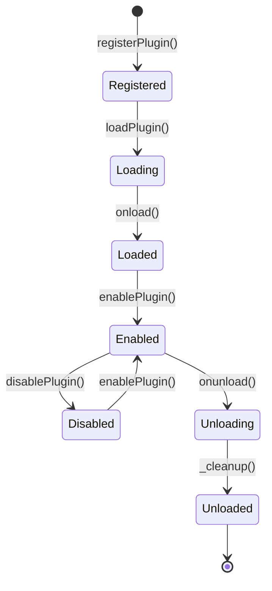

Inkdown features a powerful plugin system that allows developers to extend functionality, customize behavior, and integrate with external services. Plugins are first-class citizens in the architecture, with access to the same APIs used by built-in features.

## Plugin Architecture

Plugins in Inkdown are built on a foundation of platform-agnostic APIs, ensuring that plugins work seamlessly across Desktop, Web, and Mobile platforms without modification.

### The Plugin Base Class

All plugins extend the `Plugin` base class from `@inkdown/core`:

```typescript LivePreviewPlugin.ts
import { Plugin } from '@inkdown/core';

export default class LivePreviewPlugin extends Plugin {
    async onload(): Promise<void> {
        console.log('LivePreviewPlugin loaded');
        // Initialize plugin functionality
    }

    async onunload(): Promise<void> {
        console.log('LivePreviewPlugin unloaded');
        // Cleanup resources
    }
}
```

### Plugin Manifest

Every plugin requires a manifest that defines metadata:

```typescript manifest.ts
export const manifest: PluginManifest = {
    id: 'live-preview',
    name: 'Live Preview',
    version: '1.0.0',
    description: 'Renders markdown elements in real-time',
    author: 'Inkdown',
    minAppVersion: '0.1.0',
};
```

<ResponseField name="id" type="string" required>
  Unique identifier for the plugin (kebab-case recommended)
</ResponseField>

<ResponseField name="name" type="string" required>
  Display name shown in the UI
</ResponseField>

<ResponseField name="version" type="string" required>
  Semantic version (e.g., "1.0.0")
</ResponseField>

<ResponseField name="description" type="string">
  Brief description of plugin functionality
</ResponseField>

<ResponseField name="author" type="string">
  Plugin author name or organization
</ResponseField>

<ResponseField name="minAppVersion" type="string">
  Minimum Inkdown version required
</ResponseField>

## Plugin Capabilities

Plugins have access to a rich set of APIs to extend Inkdown's functionality:

### 1. Commands

Register commands that users can execute via command palette or hotkeys:

```typescript
this.addCommand({
    id: 'insert-timestamp',
    name: 'Insert Current Timestamp',
    hotkeys: [{ modifiers: ['Ctrl'], key: 't' }],
    callback: () => {
        const editor = this.app.editorRegistry.getActive();
        if (editor) {
            const timestamp = new Date().toISOString();
            editor.view.dispatch({
                changes: { from: editor.view.state.selection.main.from, insert: timestamp }
            });
        }
    }
});
```

### 2. Settings Tab

Create custom settings interfaces for your plugin:

```typescript
import { PluginSettingTab } from '@inkdown/core';

class MyPluginSettingTab extends PluginSettingTab {
    constructor(app: App, plugin: MyPlugin) {
        super(app, plugin);
    }

    display(): void {
        const { containerEl } = this;
        
        containerEl.createEl('h2', { text: 'My Plugin Settings' });
        
        // Add settings controls
        new Setting(containerEl)
            .setName('Enable feature')
            .setDesc('Toggle this feature on or off')
            .addToggle(toggle => toggle
                .setValue(this.plugin.settings.enabled)
                .onChange(async (value) => {
                    this.plugin.settings.enabled = value;
                    await this.plugin.saveSettings();
                })
            );
    }
}

// In plugin onload:
this.addSettingTab(new MyPluginSettingTab(this.app, this));
```

### 3. Editor Extensions

Register CodeMirror extensions to customize editor behavior:

```typescript
import { keymap } from '@codemirror/view';

this.registerEditorExtension(
    keymap.of([{
        key: 'Ctrl-k',
        run: (view) => {
            console.log('Custom key pressed');
            return true;
        }
    }])
);
```

### 4. Markdown Processing

Process markdown content with code block processors:

```typescript
this.registerMarkdownCodeBlockProcessor('mermaid', (source, el, ctx) => {
    // Render mermaid diagram
    el.innerHTML = renderMermaidDiagram(source);
});
```

Or post-process rendered markdown:

```typescript
this.registerMarkdownPostProcessor((el, ctx) => {
    // Add click handlers to all links
    const links = el.findAll('a');
    links.forEach(link => {
        link.addEventListener('click', (e) => {
            e.preventDefault();
            // Custom link handling
        });
    });
});
```

### 5. Custom Views

Register custom view types:

```typescript
this.registerView('calendar-view', (container) => {
    return new CalendarView(container, this.app);
});
```

### 6. Status Bar Items

Add items to the status bar:

```typescript
const statusBarItem = this.addStatusBarItem();
statusBarItem.setText('Word count: 0');

// Update on editor changes
this.registerEvent(
    this.app.workspace.on('editor-change', () => {
        const count = this.countWords();
        statusBarItem.setText(`Word count: ${count}`);
    })
);
```

### 7. Event Listeners

Listen to application events:

```typescript
this.registerEvent(
    this.app.workspace.on('file-open', (file) => {
        console.log('File opened:', file.path);
    })
);

this.registerEvent(
    this.app.workspace.on('file-modify', (file) => {
        console.log('File modified:', file.path);
    })
);
```

## Plugin Lifecycle

Plugins follow a well-defined lifecycle with automatic resource management:



### Lifecycle Methods

<AccordionGroup>
  <Accordion title="onload()">
    Called when the plugin is loaded and enabled. This is where you should:
    - Load plugin settings
    - Register commands
    - Add setting tabs
    - Register event listeners
    - Initialize plugin state

    ```typescript
    async onload(): Promise<void> {
        await this.loadSettings();
        
        this.addCommand({
            id: 'my-command',
            name: 'My Command',
            callback: () => this.doSomething()
        });
        
        this.addSettingTab(new MySettingTab(this.app, this));
    }
    ```
  </Accordion>
  
  <Accordion title="onunload()">
    Called when the plugin is being disabled or unloaded. Handle custom cleanup here:
    - Close open dialogs
    - Cancel pending operations
    - Save final state

    ```typescript
    async onunload(): Promise<void> {
        // Save any pending data
        await this.savePendingChanges();
        
        // Close custom UI
        this.closeCustomDialogs();
    }
    ```

    <Note>
    Commands, event listeners, status bar items, and other resources registered through plugin methods are automatically cleaned up. You only need to handle custom cleanup.
    </Note>
  </Accordion>
  
  <Accordion title="_cleanup() (Internal)">
    Automatically called by the plugin manager to clean up registered resources:
    - Unregister commands
    - Remove status bar items
    - Clear event listeners
    - Remove setting tabs
    - Clear editor extensions

    You should never call this method directly.
  </Accordion>
</AccordionGroup>

## Plugin Settings

Plugins can persist settings using the built-in data storage API:

```typescript
interface MyPluginSettings {
    apiKey: string;
    enableFeature: boolean;
    maxResults: number;
}

const DEFAULT_SETTINGS: MyPluginSettings = {
    apiKey: '',
    enableFeature: true,
    maxResults: 10
};

export default class MyPlugin extends Plugin {
    settings: MyPluginSettings;

    async onload() {
        await this.loadSettings();
        // Use this.settings...
    }

    async loadSettings() {
        this.settings = Object.assign(
            {},
            DEFAULT_SETTINGS,
            await this.loadData()
        );
    }

    async saveSettings() {
        await this.saveData(this.settings);
    }
}
```

<Tip>
Settings are automatically stored in the platform-appropriate location:
- **Desktop (Tauri)**: JSON files in the app config directory
- **Web**: LocalStorage
- **Mobile**: AsyncStorage
</Tip>

## Built-in Plugins

Inkdown includes several built-in plugins that demonstrate best practices:

<CardGroup cols={2}>
  <Card title="Live Preview" icon="eye">
    Renders markdown syntax in real-time, hiding markers and showing formatted text
  </Card>
  <Card title="Word Count" icon="calculator">
    Displays word and character count in the status bar
  </Card>
  <Card title="Quick Finder" icon="search">
    Fast file search with fuzzy matching
  </Card>
  <Card title="Slash Commands" icon="terminal">
    Quick insertion commands triggered by `/`
  </Card>
  <Card title="Emoji" icon="smile">
    Emoji picker and autocomplete
  </Card>
</CardGroup>

## Plugin Manager API

The `PluginManager` handles plugin registration, loading, and lifecycle:

```typescript
// Check if a plugin is enabled
if (app.pluginManager.isPluginEnabled('live-preview')) {
    // Do something
}

// Enable a plugin
await app.pluginManager.enablePlugin('word-count');

// Disable a plugin
await app.pluginManager.disablePlugin('word-count');

// Get all plugins
const allPlugins = app.pluginManager.getAllPlugins();

// Get plugin instance
const plugin = app.pluginManager.getPlugin('live-preview');

// Listen for plugin changes
app.pluginManager.onPluginChange((pluginId, changeType) => {
    console.log(`Plugin ${pluginId} was ${changeType}`);
});
```

## Cross-Platform Compatibility

Plugins remain platform-agnostic by using bridge patterns:

```typescript
import { native } from '@inkdown/core';

// Access file system (works on Desktop, Web, Mobile)
const content = await native.fs.readFile('/path/to/file.md');

// Show dialog (if platform supports it)
if (native.dialog) {
    const result = await native.dialog.showSaveDialog({
        defaultPath: 'export.md'
    });
}

// Check platform capabilities
if (native.supports('nativeDialog')) {
    // Use native dialog
} else {
    // Use fallback dialog
}
```

<Warning>
Avoid using platform-specific APIs directly (like `window`, `document`, or Tauri APIs) in plugin code. Always use the provided bridge APIs for maximum compatibility.
</Warning>

## Best Practices

<AccordionGroup>
  <Accordion title="Resource Cleanup">
    Always use plugin registration methods for resources that need cleanup:
    
    ```typescript
    // Good - automatically cleaned up
    this.registerDomEvent(document, 'click', handler);
    this.registerInterval(() => doSomething(), 1000);
    
    // Bad - you must manually clean up
    document.addEventListener('click', handler);
    setInterval(() => doSomething(), 1000);
    ```
  </Accordion>
  
  <Accordion title="Error Handling">
    Handle errors gracefully and show user-friendly messages:
    
    ```typescript
    try {
        await this.performOperation();
        this.showNotice('Operation successful!');
    } catch (error) {
        console.error('Operation failed:', error);
        this.showNotice('Operation failed. Please try again.');
    }
    ```
  </Accordion>
  
  <Accordion title="Performance">
    - Debounce expensive operations
    - Use viewport-based processing for editor decorations
    - Cache computed values when possible
    - Lazy-load heavy dependencies
    
    ```typescript
    // Debounce expensive processing
    const debouncedUpdate = debounce(() => {
        this.updateExpensiveView();
    }, 300);
    
    this.registerEvent(
        this.app.workspace.on('editor-change', debouncedUpdate)
    );
    ```
  </Accordion>
  
  <Accordion title="User Experience">
    - Provide clear command names and descriptions
    - Use intuitive keyboard shortcuts
    - Show feedback for long operations
    - Validate user input
    - Handle edge cases gracefully
  </Accordion>
</AccordionGroup>

## Community Plugins

Community plugins are installed from GitHub repositories:

```typescript
// Install a community plugin
await app.communityPluginManager.installPlugin(
    'username/repo-name'
);

// Update a plugin
await app.communityPluginManager.updatePlugin('plugin-id');

// Uninstall a plugin
await app.communityPluginManager.uninstallPlugin('plugin-id');
```

<Info>
Community plugins are loaded dynamically and have the same capabilities as built-in plugins.
</Info>

## Related Documentation

<CardGroup cols={2}>
  <Card title="Build Your First Plugin" icon="hammer" href="/plugins/introduction">
    Step-by-step guide to creating an Inkdown plugin
  </Card>
  <Card title="Plugin API Reference" icon="book" href="/plugins/plugin-class">
    Complete API documentation for plugin development
  </Card>
  <Card title="Architecture Overview" icon="sitemap" href="/concepts/architecture">
    Understand Inkdown's overall architecture
  </Card>
  <Card title="Cross-Platform" icon="layer-group" href="/concepts/cross-platform">
    Learn about platform compatibility
  </Card>
</CardGroup>