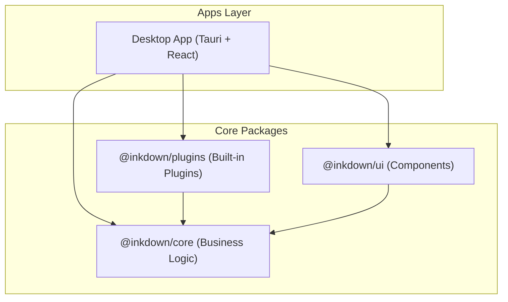

## What is Inkdown?

Inkdown is a **modern, fast, privacy-focused markdown editor** designed for taking and organizing notes. Built with [Tauri](https://tauri.app/), React, and TypeScript, Inkdown combines the power of a native desktop application with the flexibility of web technologies.

<Note>
  Inkdown is **local-first** — your notes stay on your computer, giving you complete control over your data.
</Note>

## Key Features

<CardGroup cols={2}>
  <Card title="Markdown Editor" icon="file-pen">
    Full-featured editor powered by CodeMirror 6 with syntax highlighting, smart completions, and custom extensions.
  </Card>
  
  <Card title="Live Preview" icon="eye">
    See your formatting as you type with real-time markdown rendering.
  </Card>
  
  <Card title="Local-First" icon="hard-drive">
    Your notes stay on your computer. No cloud required, complete privacy.
  </Card>
  
  <Card title="Themes" icon="palette">
    Dark, light, and custom themes with full CSS variable support for complete customization.
  </Card>
  
  <Card title="Plugin System" icon="puzzle-piece">
    Extend functionality with built-in and community plugins. Create your own plugins using the powerful Plugin API.
  </Card>
  
  <Card title="Keyboard-Centric" icon="keyboard">
    Vim mode support, customizable shortcuts, and keyboard-first navigation for power users.
  </Card>
</CardGroup>

## Cross-Platform

Inkdown runs natively on all major desktop platforms:

- **macOS** (Apple Silicon & Intel)
- **Windows** (64-bit)
- **Linux** (AppImage format)

## Technology Stack

Inkdown is built with modern, battle-tested technologies:

| Component | Technology |
|-----------|------------|
| Desktop Framework | Tauri v2 (Rust backend) |
| Frontend | React 19 + TypeScript |
| Editor | CodeMirror 6 |
| Styling | CSS Variables |
| Package Manager | Bun |
| Build Tool | Vite |

## Architecture

Inkdown follows a **modular monorepo architecture** with platform-agnostic core and platform-specific adapters:



<Accordion title="Package Structure">
  ```
  inkdown/
  ├── apps/
  │   └── desktop/          # Tauri desktop app
  ├── packages/
  │   ├── core/             # @inkdown/core - Business logic, Plugin API
  │   ├── ui/               # @inkdown/ui - React components
  │   ├── plugins/          # @inkdown/plugins - Built-in plugins
  │   └── native-tauri/     # @inkdown/native-tauri - Tauri bindings
  └── docs/                 # Documentation
  ```
</Accordion>

## Who is Inkdown for?

<CardGroup cols={3}>
  <Card title="Note Takers" icon="note-sticky">
    Anyone who wants a fast, distraction-free markdown editor for daily notes, journaling, or knowledge management.
  </Card>
  
  <Card title="Developers" icon="code">
    Programmers who want to take technical notes with code highlighting, live preview, and Git-friendly plain text files.
  </Card>
  
  <Card title="Power Users" icon="bolt">
    Users who value keyboard shortcuts, customization, plugins, and complete control over their tools and data.
  </Card>
</CardGroup>

## Privacy First

<Warning>
  Inkdown is designed with **privacy as a core principle**:
  
  - All notes stored locally on your machine
  - No telemetry or tracking
  - Optional end-to-end encrypted sync (coming soon)
  - Open source — verify the code yourself
</Warning>

## Open Source

Inkdown is **MIT licensed** and fully open source. Contributions are welcome!

- **Repository**: [github.com/inkdown/inkdown](https://github.com/inkdown/inkdown)
- **License**: MIT
- **Author**: [Lucas Furquim](https://github.com/l-furquim)

## Next Steps

Ready to get started?

<CardGroup cols={2}>
  <Card title="Quickstart" icon="rocket" href="/quickstart">
    Get up and running in minutes
  </Card>
  
  <Card title="Installation" icon="download" href="/installation">
    Detailed installation instructions for your platform
  </Card>
</CardGroup>
