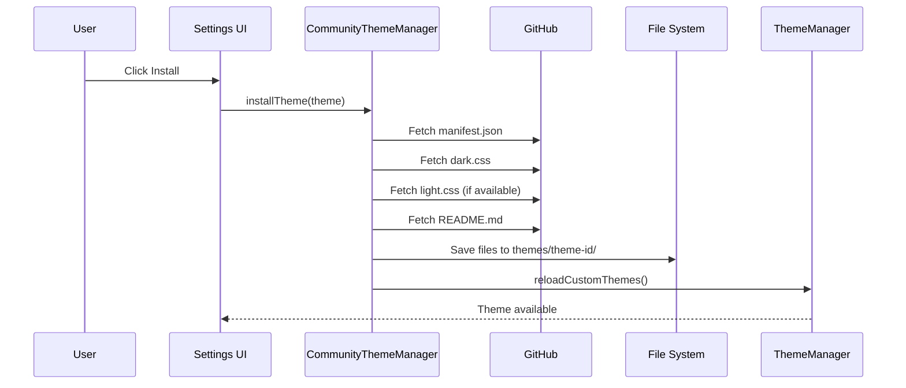

Inkdown supports a community theme system that allows you to share your themes and use themes created by others.

## Installing Community Themes

### From the UI

1. Open **Settings → Appearance → Themes**
2. Click **Browse Community Themes**
3. Browse available themes in the gallery
4. Click **Install** on any theme you like
5. The theme will be downloaded and appear in your theme list

### Theme Installation Flow

When you install a community theme:



**Source**: From theme-system.md documentation

## Publishing Your Theme

### Step 1: Create Your Theme

Follow the [quickstart guide](/themes/quickstart) to create your theme locally.

Your theme should have:

```
my-theme/
├── manifest.json    # Required: Theme metadata
├── dark.css        # Required for dark mode
├── light.css       # Required for light mode (if supported)
└── README.md       # Optional: Documentation
```

### Step 2: Create GitHub Repository

Create a new repository on GitHub:

```bash
# Initialize repository
cd my-theme
git init

# Add files
git add manifest.json dark.css light.css README.md
git commit -m "Initial theme release"

# Create repository on GitHub and push
git remote add origin https://github.com/yourusername/my-theme.git
git branch -M main
git push -u origin main
```

### Step 3: Create manifest.json

Ensure your `manifest.json` is complete and accurate:

```json
{
  "name": "My Awesome Theme",
  "author": "Your Name",
  "version": "1.0.0",
  "description": "A beautiful theme with vibrant colors and great contrast",
  "homepage": "https://github.com/yourusername/my-awesome-theme",
  "modes": ["dark", "light"]
}
```

### Step 4: Submit to Community Registry

<Note>
  The community theme registry is a curated list maintained by the Inkdown team.
</Note>

1. Fork the [inkdown-themes](https://github.com/inkdown/inkdown-themes) repository
2. Add your theme to `themes.json`:

```json
{
  "themes": [
    {
      "id": "my-awesome-theme",
      "name": "My Awesome Theme",
      "author": "Your Name",
      "repo": "yourusername/my-awesome-theme",
      "branch": "main",
      "modes": ["dark", "light"]
    }
  ]
}
```

3. Create a pull request with:
   - Theme entry in `themes.json`
   - Screenshot showing your theme
   - Brief description of your theme's design philosophy

### Step 5: Maintain Your Theme

As you update your theme:

1. Update the `version` in `manifest.json`
2. Document changes in your README.md
3. Create a new release on GitHub
4. Users will see an update notification in Inkdown

## Theme Requirements

To be accepted into the community registry, themes must:

### Technical Requirements

- ✅ Valid `manifest.json` with all required fields
- ✅ At least one CSS file (`dark.css` or `light.css`)
- ✅ CSS uses only documented theme variables
- ✅ No JavaScript or executable code
- ✅ Proper semantic versioning

### Quality Requirements

- ✅ Readable text with sufficient contrast (WCAG AA minimum)
- ✅ All UI elements styled appropriately
- ✅ Tested with various markdown content
- ✅ No broken colors or invisible elements
- ✅ Includes preview screenshots

### Repository Requirements

- ✅ Public GitHub repository
- ✅ README.md with theme description and screenshots
- ✅ License file (MIT, Apache, or similar permissive license)
- ✅ No malicious or tracking code

## Theme Discovery

### Caching Strategy

The CommunityThemeManager uses in-memory caching to improve performance:

```typescript
interface CommunityThemeCache {
    lastFetched: number;                      // Timestamp for TTL check
    listings: CommunityThemeListing[];        // Basic theme info from registry
    themes: Record<string, CommunityTheme>;   // Full theme details (on-demand)
}
```

- **TTL**: 1 hour
- **Invalidation**: Manual refresh or automatic on TTL expiry
- **Storage**: In-memory only (not persisted between sessions)

**Source**: From theme-system.md documentation

### Features

| Feature | Description |
|---------|-------------|
| Browse Themes | Fetches theme listings from the community registry |
| Caching | In-memory cache with 1-hour TTL |
| Install/Uninstall | Downloads and saves theme files locally |
| Version Tracking | Tracks installed versions for update detection |

## Managing Installed Themes

### View Installed Themes

All installed themes appear in Settings → Appearance → Themes:

- Built-in themes (Default Dark, Default Light)
- Custom themes (locally created)
- Community themes (installed from GitHub)

### Update Themes

When a theme author releases an update:

1. Inkdown checks for updates when browsing community themes
2. An "Update" button appears for outdated themes
3. Click to download and install the latest version
4. Your current theme settings are preserved

### Uninstall Themes

To remove a community theme:

1. Open Settings → Appearance → Themes
2. Find the theme you want to remove
3. Click the trash icon or **Uninstall** button
4. Theme files are removed from disk
5. If the theme was active, Inkdown switches to the default theme

## Theme Repository Structure

Recommended repository structure for sharing your theme:

```
my-awesome-theme/
├── manifest.json           # Theme metadata
├── dark.css               # Dark mode styles
├── light.css              # Light mode styles
├── README.md              # Documentation
├── LICENSE                # License file
├── screenshots/           # Preview images
│   ├── dark-preview.png
│   └── light-preview.png
└── examples/              # Example markdown files
    ├── demo.md
    └── syntax-test.md
```

## README Template

Use this template for your theme's README:

```markdown
# My Awesome Theme

A beautiful Inkdown theme with vibrant colors and excellent readability.

## Preview

### Dark Mode


### Light Mode


## Features

- 🎨 Vibrant accent colors for better visual hierarchy
- 👁️ Carefully tuned contrast for extended reading
- ✨ Beautiful syntax highlighting for code blocks
- 🌙 Full dark and light mode support

## Installation

### From Inkdown (Recommended)

1. Open Settings → Appearance → Themes
2. Click "Browse Community Themes"
3. Search for "My Awesome Theme"
4. Click "Install"

### Manual Installation

1. Download this repository
2. Copy to your themes directory:
   - macOS: `~/Library/Application Support/com.furqas.inkdown/themes/`
   - Linux: `~/.config/inkdown/themes/`
   - Windows: `%APPDATA%/inkdown/themes/`
3. Restart Inkdown

## Design Philosophy

[Describe your design choices, color palette inspiration, and intended use cases]

## License

MIT License - feel free to modify and share!
```

## Best Practices for Theme Authors

### 1. Provide Good Screenshots

Show your theme with real content:
- Different heading levels
- Bold, italic, links
- Code blocks with syntax highlighting
- Lists and blockquotes
- Tables and callouts

### 2. Document Color Choices

Explain your color palette:

```markdown
## Color Palette

- **Primary**: #0969da - Trustworthy blue for interactive elements
- **Success**: #2ea043 - Vibrant green for positive actions
- **Warning**: #fb8500 - Attention-grabbing orange
- **Danger**: #cf222e - Clear red for destructive actions
```

### 3. Support Both Modes

If possible, provide both light and dark modes. This makes your theme more versatile and accessible.

### 4. Version Your Releases

Use semantic versioning:
- `1.0.0` - Initial release
- `1.1.0` - Add light mode support
- `1.1.1` - Fix heading colors
- `2.0.0` - Major redesign

### 5. Respond to Issues

Monitor your theme repository for:
- Bug reports (colors not working)
- Feature requests (add light mode)
- Accessibility concerns (contrast issues)

### 6. Test Thoroughly

Before publishing:
- Test with all markdown elements
- Check contrast ratios
- Try different font sizes
- Test on different displays
- Get feedback from others

## Theme Metadata Types

### CommunityThemeListing

From the community registry index:

```typescript
interface CommunityThemeListing {
    id: string;           // Unique identifier
    name: string;         // Display name
    author: string;       // Author name
    repo: string;         // GitHub repo (e.g., "author/repo")
    branch?: string;      // Branch name (default: "main")
    modes: ColorScheme[]; // Supported modes
}
```

**Source**: From theme-system.md documentation

## FAQ

<AccordionGroup>
  <Accordion title="How long does theme review take?">
    Theme submissions are typically reviewed within 1-2 weeks. Complex themes or those requiring changes may take longer.
  </Accordion>

  <Accordion title="Can I update my theme after publishing?">
    Yes! Just update your GitHub repository and bump the version in manifest.json. Users will be notified of the update.
  </Accordion>

  <Accordion title="What if my theme is rejected?">
    You'll receive feedback on what needs to be fixed. Most rejections are for contrast issues or incomplete themes.
  </Accordion>

  <Accordion title="Can I monetize my theme?">
    Community registry themes must be free and open source. You can accept donations or create paid themes distributed separately.
  </Accordion>

  <Accordion title="How do I remove my theme from the registry?">
    Submit a pull request removing your theme from themes.json. Your repository can remain public.
  </Accordion>
</AccordionGroup>

## Next Steps

<CardGroup cols={2}>
  <Card title="Quick Start" icon="rocket" href="/themes/quickstart">
    Create your first theme
  </Card>
  <Card title="Best Practices" icon="star" href="/themes/best-practices">
    Tips for creating great themes
  </Card>
  <Card title="CSS Variables" icon="palette" href="/themes/css-variables">
    Complete variable reference
  </Card>
</CardGroup>
