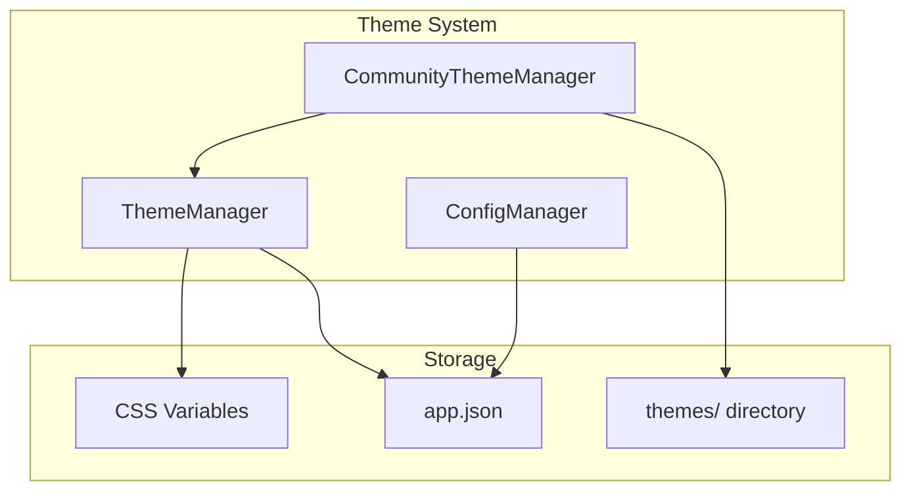

Understanding Inkdown's CSS architecture helps you create better themes and debug styling issues.

## Theme Application Flow

### Built-in Themes

Built-in themes (default-dark, default-light) are bundled with the application and use CSS classes:

```typescript
// Simply swap the class on documentElement
document.documentElement.className = 'theme-dark';
// or
document.documentElement.className = 'theme-light';
```

The CSS for built-in themes is pre-loaded in the app bundle, so switching is instant.

### Custom Themes

Custom themes are loaded from disk and injected dynamically:

```typescript
private applyCustomThemeCSS(cssContent: string): void {
    // Remove any existing custom theme
    const existing = document.getElementById('inkdown-custom-theme');
    if (existing) existing.remove();
    
    // Inject new theme CSS
    const styleElement = document.createElement('style');
    styleElement.id = 'inkdown-custom-theme';
    styleElement.textContent = cssContent;
    document.head.appendChild(styleElement);
}
```

**Source**: `packages/core/src/ThemeManager.ts:76-86`

## CSS Class Structure

All themes use the `.theme-dark` or `.theme-light` class as the root selector:

```css
.theme-dark {
    /* All theme variables go here */
    --bg-primary: #161618;
    --text-primary: #e0e0e0;
    /* ... */
}
```

This allows themes to coexist in the CSS without conflicts.

## Variable Inheritance

Inkdown uses a three-layer CSS variable system:

### Layer 1: Shared Variables

Font stacks, spacing, and sizing constants that are the same across all themes:

```css
:root,
.theme-dark,
.theme-light {
    /* Font Families */
    --font-family: system-ui, -apple-system, BlinkMacSystemFont, 'SF Pro Display', 'Segoe UI', Roboto, Helvetica, Arial, sans-serif;
    --font-family-mono: ui-monospace, 'SF Mono', 'Cascadia Code', 'Source Code Pro', Menlo, Consolas, monospace;

    /* Base Sizes */
    --font-size-base: 14px;
    --spacing-md: 16px;
    --radius-md: 6px;
    
    /* Heading Sizes */
    --heading-h1-size: 2em;
    --heading-h2-size: 1.6em;
    --heading-h3-size: 1.4em;
}
```

**Source**: `packages/core/src/styles/themes/_shared.css`

### Layer 2: Theme-Specific Colors

Each theme defines colors and visual styling:

```css
.theme-dark {
    --bg-primary: #161618;
    --text-primary: #e0e0e0;
    --color-primary: #007acc;
    /* ... */
}

.theme-light {
    --bg-primary: #ffffff;
    --text-primary: #24292f;
    --color-primary: #0969da;
    /* ... */
}
```

**Sources**:
- `packages/core/src/styles/themes/default-dark.css`
- `packages/core/src/styles/themes/default-light.css`

### Layer 3: Component Styles

Components reference theme variables:

```css
.editor {
    background: var(--editor-bg);
    color: var(--editor-fg);
}

.sidebar {
    background: var(--bg-sidebar);
    border-right: 1px solid var(--border-color);
}

button.primary {
    background: var(--button-primary-bg);
    color: var(--button-primary-text);
}
```

## CSS Loading Order

1. **Base styles**: Reset, typography, layout
2. **Shared variables**: Constants and sizing
3. **Built-in theme CSS**: Default dark/light themes
4. **Component styles**: UI components and editor
5. **Custom theme injection** (if applicable): Dynamically loaded

This order ensures custom themes can override anything while inheriting shared constants.

## Selector Specificity

Themes use a flat specificity hierarchy:

```css
/* Low specificity - easily overridden */
.theme-dark {
    --color-primary: #007acc;
}

/* Components reference variables */
.button {
    background: var(--color-primary);
}
```

Avoid deep nesting in themes:

```css
/* ❌ Bad - too specific */
.theme-dark .editor .heading h1 {
    color: #569cd6;
}

/* ✅ Good - use variables */
.theme-dark {
    --heading-h1: #569cd6;
}
```

## Color Scheme Switching

When switching between light and dark modes:

```typescript
// For built-in themes: swap CSS class
document.documentElement.className = newScheme === 'dark' 
    ? 'theme-dark' 
    : 'theme-light';

// For custom themes with both modes: load different CSS file
const cssFile = `${colorScheme}.css`; // 'dark.css' or 'light.css'
const cssContent = await readThemeCss(themeId, cssFile);
applyCustomThemeCSS(cssContent);
```

**Source**: `packages/core/src/ThemeManager.ts:169-192`

## Theme Manager Architecture



### ThemeManager Responsibilities

- Registering built-in themes
- Loading custom themes from disk
- Applying themes by setting CSS classes or injecting CSS
- Managing color scheme switching
- Persisting theme preferences
- Emitting theme change events

**Source**: `packages/core/src/ThemeManager.ts`

### Initialization Flow

```typescript
async init(): Promise<void> {
    // 1. Register built-in themes
    this.registerBuiltInThemes();
    
    // 2. Load custom themes from disk
    await this.loadCustomThemes();
    
    // 3. Load saved preference from config
    const config = await this.app.configManager.loadConfig('app');
    this.colorScheme = config?.colorScheme || 'dark';
    this.currentTheme = config?.theme || 'default-dark';
    
    // 4. Apply the theme
    this.applyColorScheme(this.colorScheme);
}
```

**Source**: From theme-system.md documentation

## Performance Considerations

### CSS Variable Performance

CSS variables are extremely fast. The browser handles variable resolution natively:

```css
/* No performance cost */
.element {
    color: var(--text-primary);
    background: var(--bg-primary);
}
```

### Theme Switching Performance

- **Built-in themes**: Instant (just a class swap)
- **Custom themes**: ~50ms (read file + inject CSS)

### Optimization Tips

1. **Minimize custom CSS**: Only define variables you need to change
2. **Avoid expensive selectors**: Keep selectors simple and flat
3. **Use variable references**: `--cursor: var(--color-primary)` instead of duplicating colors
4. **Batch theme loads**: Load all theme metadata at startup, defer CSS loading until needed

## File Organization

```
packages/core/src/styles/
├── themes/
│   ├── _shared.css          # Shared constants
│   ├── default-dark.css     # Built-in dark theme
│   └── default-light.css    # Built-in light theme
├── base.css                 # Base styles
├── index.css                # Main entry point
└── plugin-api.css           # Plugin UI styles

~/Library/Application Support/com.furqas.inkdown/themes/
└── my-theme/
    ├── manifest.json        # Theme metadata
    ├── dark.css            # Dark mode styles
    ├── light.css           # Light mode styles (optional)
    └── README.md           # Documentation (optional)
```

## Best Practices

<Note>
  **Always use CSS variables** instead of hardcoded colors. This ensures themes can be customized.
</Note>

<Warning>
  **Never use `!important`** in themes. It breaks customization and causes specificity wars.
</Warning>

<Tip>
  **Test with multiple content types** including code blocks, tables, callouts, and lists to ensure complete coverage.
</Tip>

## Next Steps

<CardGroup cols={2}>
  <Card title="CSS Variables" icon="palette" href="/themes/css-variables">
    Complete reference of all theme variables
  </Card>
  <Card title="Color Schemes" icon="sun-moon" href="/themes/color-schemes">
    Light/dark mode implementation
  </Card>
</CardGroup>
